# socialNET Intelligence

[](https://github.com/kinuthia-mark/Social-intelligence/actions/workflows/ci.yml)


A brand monitoring and social media intelligence dashboard. It collects mentions of a brand, scores their sentiment, flags the ones that could turn into a crisis, and produces reports for leadership.

The idea is similar to Brandwatch or Sprout Social, scaled down for a single team. The frontend is Next.js, the API is Django REST Framework, and sign-in uses JWTs kept in httpOnly cookies.

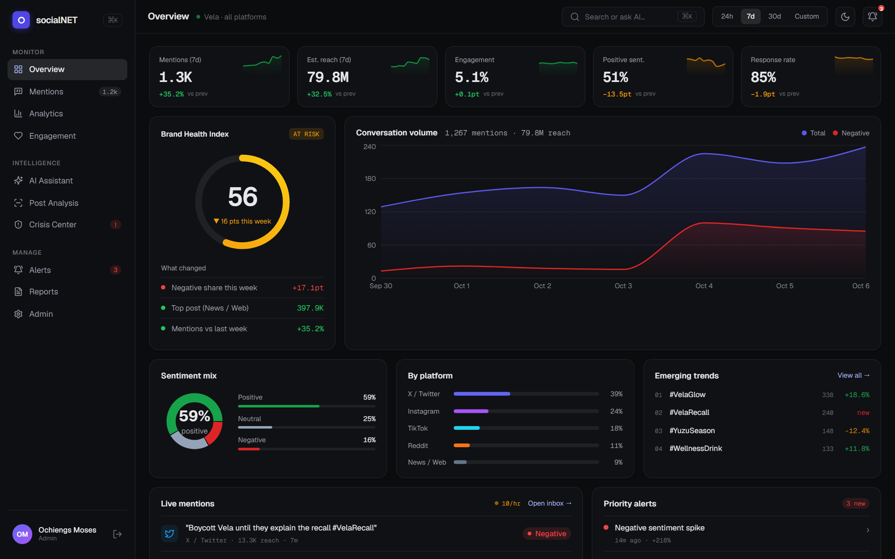

**Highlights**

- 14 screens with a dark, data-dense design, a command palette (Ctrl+K) and a mobile layout
- A **sentiment and risk engine** written from scratch (`backend/intel/sentiment.py`): paste any post and get a sentiment split, emotions, topics, risk terms and recommended actions. It handles negation ("not good"), intensifiers, shouting and emoji, and needs no API key
- A **data assistant** that answers questions about sentiment, influencers, risks and platforms by querying the database, so its numbers always match the dashboards
- JWT auth where the browser never sees a token: Next.js route handlers keep them in httpOnly cookies, and refresh tokens are rotated and blacklisted on logout
- Every number on the dashboards is computed from about 10,000 mentions in the database, labelled by the same sentiment engine
- 42 backend tests, 17 frontend tests (Vitest), a TypeScript check, a production build and a full Docker Compose run in CI on every push

---

## Screenshots

| Mentions inbox with detail panel | Crisis command centre |
|---|---|
| 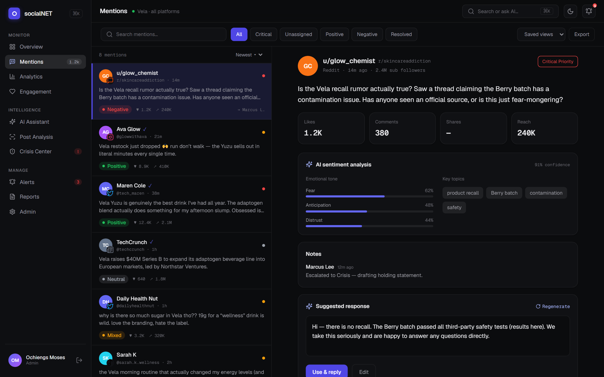 | 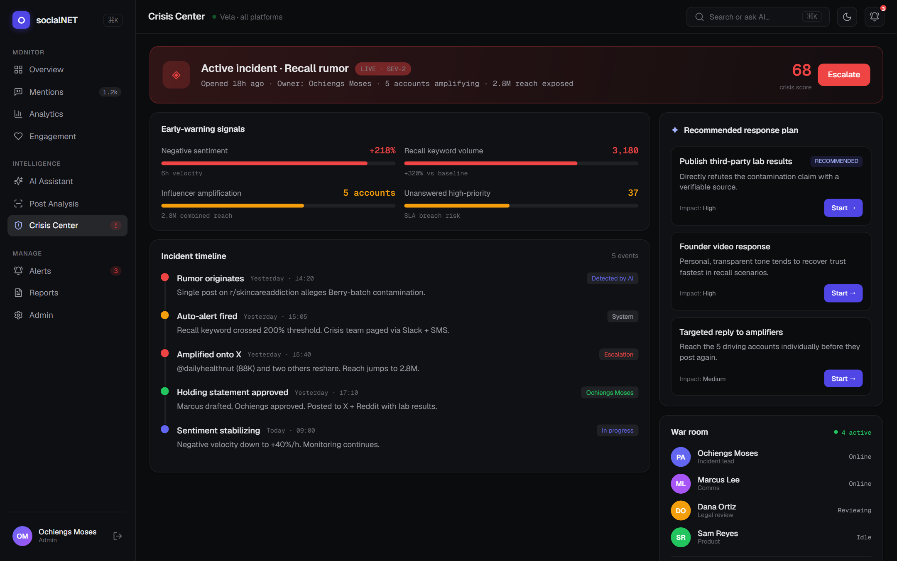 |
| **Post analysis of pasted text** | **Data assistant** |
| 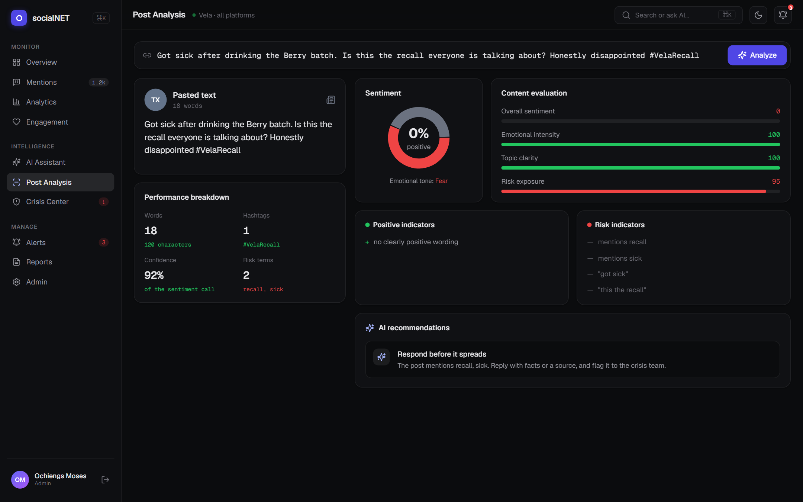 | 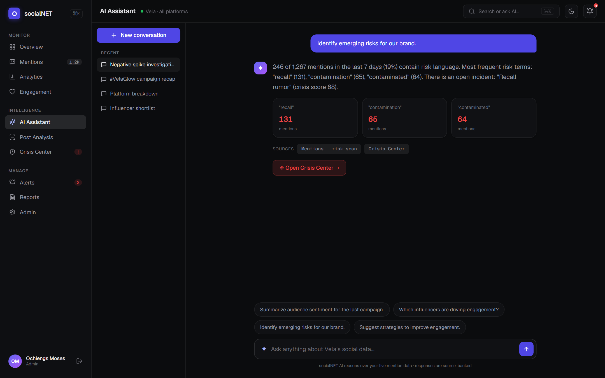 |
| **Analytics** | **Landing page** |
| 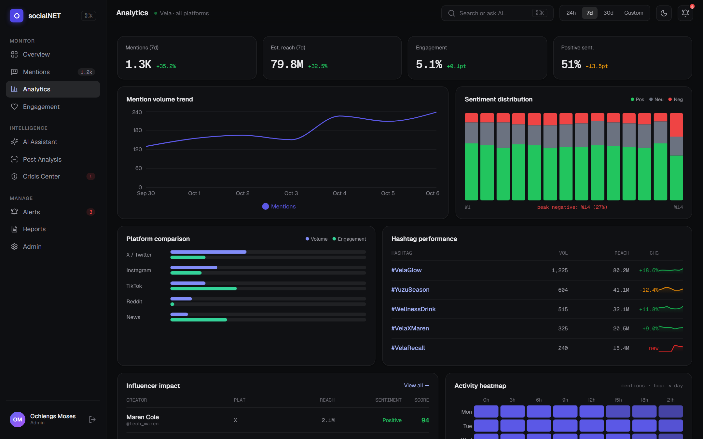 | 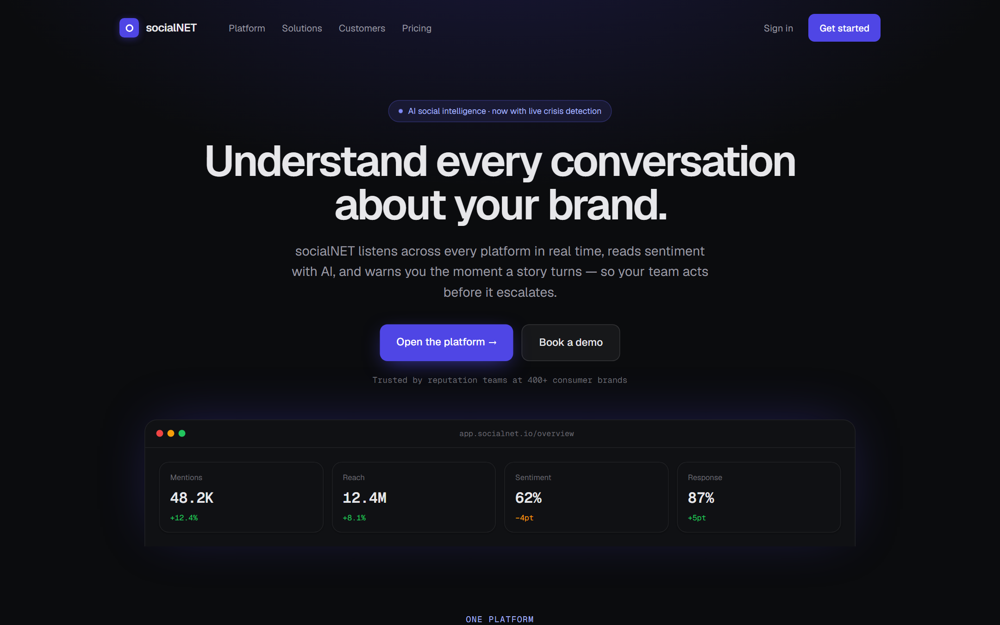 |

<details>
<summary>More screens: alerts, reports, engagement, admin, mobile</summary>

| | |
|---|---|
| 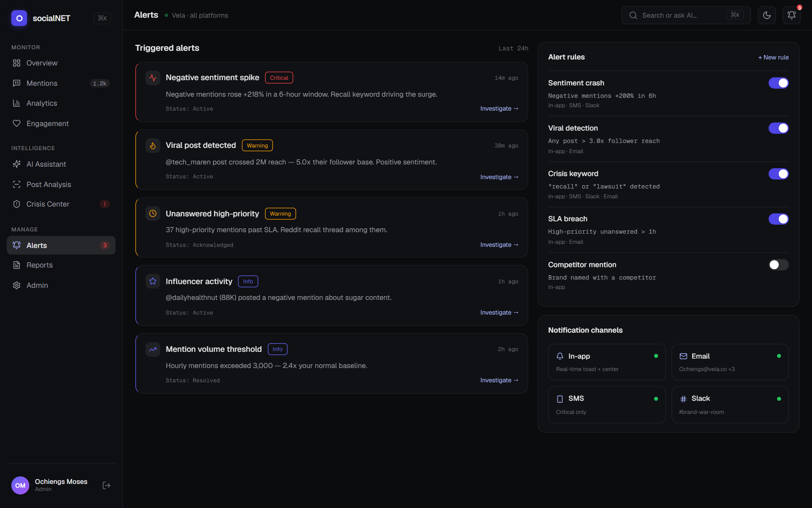 | 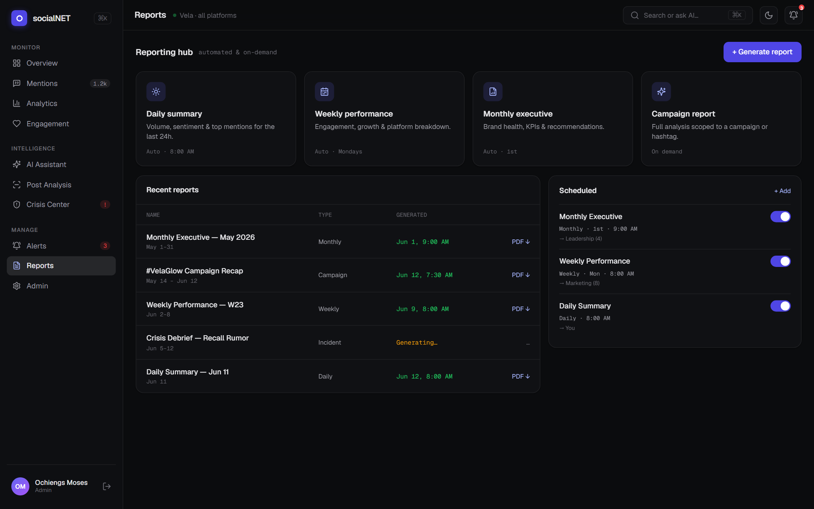 |
| 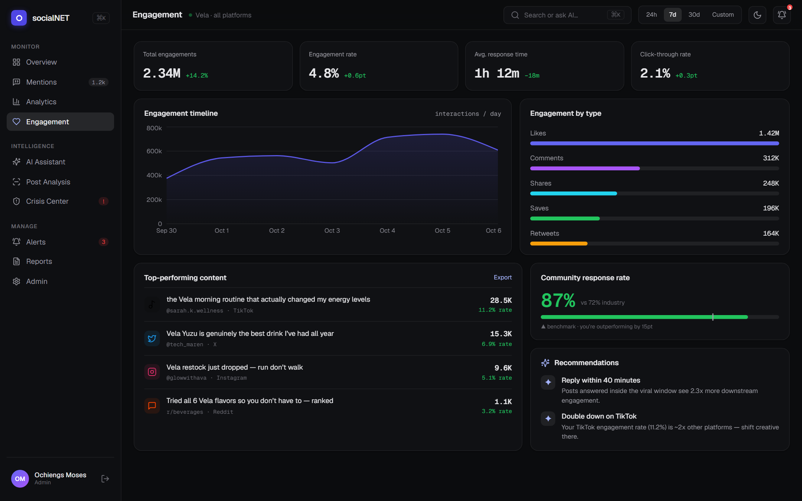 | 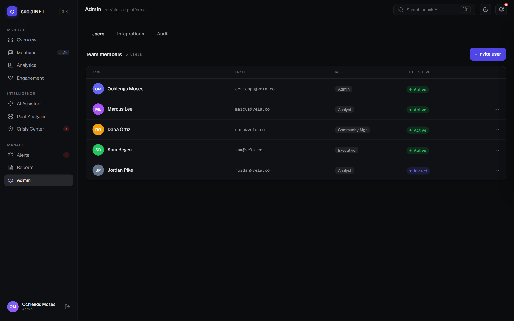 |

<p align="center">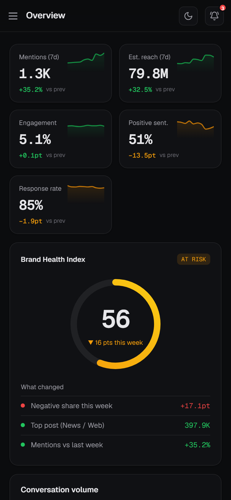</p>
</details>

---

## What it does

A brand gets talked about across X (Twitter), Instagram, LinkedIn, Reddit and other platforms. Most of those posts are harmless. A few of them are the start of a PR problem.

socialNET gathers those mentions in one place, filters out the noise, raises an alert when something looks like a crisis, shows what the audience actually thinks, and generates a PDF report that can go straight to management.

---

## Quick start

### With Docker (one command)

```bash
docker compose up --build
```

Open `http://localhost:3000` and sign in with the demo account below. Compose builds the Django API (served by Gunicorn) and the Next.js app, and loads the demo dataset on start.

### Without Docker

You need two terminals running at the same time.

### Backend (Django)

```bash
cd backend
python -m venv .venv
.venv\Scripts\pip install -r requirements.txt     # Windows
# .venv/bin/pip install -r requirements.txt       # macOS/Linux

.venv\Scripts\python manage.py migrate
.venv\Scripts\python manage.py seed_data
.venv\Scripts\python manage.py runserver 8500
```

The API is now running on `http://localhost:8500`.

### Frontend (Next.js)

In a **new terminal**:

```bash
npm install
npm run dev
```

Open `http://localhost:3000`.

### Sign in

Use the seeded demo account:
- **Email:** ochiengs@vela.co
- **Password:** vela-demo-2026

Every account in the demo dataset uses that password. You can also register a new account.

---

## Architecture


**How a request travels:**
1. You use the app in the browser
2. Components ask for data through TanStack Query
3. Queries call `src/lib/api.ts`
4. The API layer calls the Next.js `/api/*` endpoints
5. Next.js handles `/api/auth/*` itself (to set cookies) and rewrites everything else to Django
6. Django checks the JWT cookie and returns JSON
7. Components re-render with the new data

The browser never talks to Django directly. Every request goes through Next.js first.

---

## Authentication flow

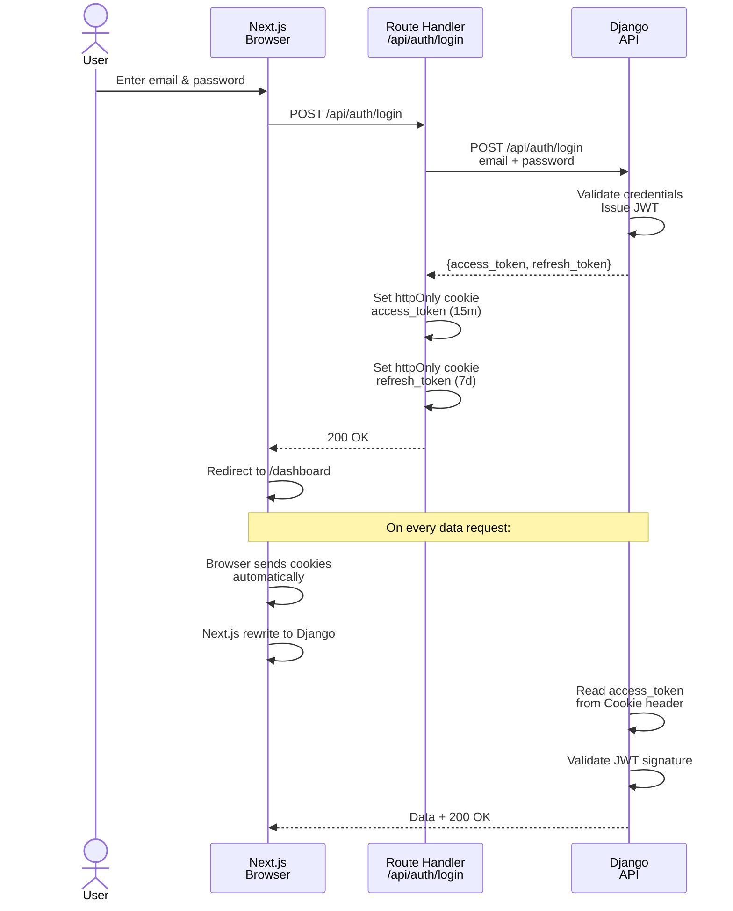

**Key points:**
- Tokens live in **httpOnly cookies**, so page scripts cannot read them
- The access token lasts 15 minutes, the refresh token 7 days
- When the access token expires, `src/lib/api.ts` refreshes it and retries the request
- Refresh tokens are rotated, and the old one is blacklisted on logout
- Cookies are `SameSite=Lax`, which blocks cross-site form posts

---

## The screens

| Route | What it does |
|-------|------------|
| `/` | Landing page |
| `/login` | Sign in |
| `/register` | Create account |
| `/dashboard` | KPIs, trends, executive summary |
| `/mentions` | Browse all mentions, filter by sentiment, platform and date. Clicking one opens a slide-over with details, a suggested reply and team notes |
| `/analytics` | Sentiment breakdown, platform comparison, influencers, heatmaps |
| `/engagement` | Replies, shares and engagement rate over time |
| `/alerts` | Notification centre and alert rules |
| `/reports` | Generate, download (PDF) and schedule reports |
| `/post-analysis` | Analysis of a draft or published post |
| `/assistant` | Chat with the assistant about the brand's data |
| `/crisis` | Crisis command centre with a timeline of events |
| `/admin` | Three tabs: team members, connected social accounts, audit log |
| `/profile` | Your name, email and preferences |

Every screen has loading skeletons, empty states and a layout that works on desktop, tablet and phone. A command palette (Ctrl+K) jumps between screens.

---

## Directory structure

```
.
├── src/
│   ├── app/
│   │   ├── (auth)/           ← login and register
│   │   ├── (app)/            ← one folder per screen (dashboard, mentions, crisis, admin, profile ...)
│   │   ├── api/
│   │   │   └── auth/         ← JWT cookie handlers (login, register, refresh, logout)
│   │   ├── globals.css       ← Design tokens (colours, spacing, fonts)
│   │   ├── layout.tsx        ← Root layout + providers
│   │   └── page.tsx          ← Landing page
│   ├── components/
│   │   ├── layout/           ← Sidebar, Topbar, PageHeading, CommandPalette, nav.ts
│   │   ├── ui/               ← Button, Card, Badge, Avatar, Sheet, etc.
│   │   ├── charts/           ← Recharts wrappers and the heatmap
│   │   ├── dashboard/        ← KPI cards and the brand health gauge
│   │   └── mentions/         ← Mention card and detail view
│   ├── lib/
│   │   ├── api.ts            ← Every backend call goes through here
│   │   ├── queries.ts        ← TanStack Query hooks (useKpis, useMentions, etc.)
│   │   ├── store.ts          ← Zustand stores (dateRange, sidebarOpen, etc.)
│   │   ├── types.ts          ← TypeScript interfaces (mirror the Django models)
│   │   ├── authCookies.ts    ← Cookie names shared with the route handlers
│   │   ├── csv.ts            ← CSV export helper
│   │   └── utils.ts          ← Formatting helpers
│   └── middleware.ts         ← Redirects signed-out users to /login
├── backend/
│   ├── config/               ← Django project settings
│   ├── accounts/             ← Login, register, JWT logic, tests
│   ├── intel/                ← Main app
│   │   ├── models.py         ← Mention, Alert, Report, Crisis, etc.
│   │   ├── views.py          ← API endpoints
│   │   ├── serializers.py    ← JSON serialisation
│   │   ├── sentiment.py      ← Sentiment, emotion, topic and risk engine
│   │   ├── assistant.py      ← Data assistant: question router + DB queries
│   │   ├── history.py        ← Generates 14 weeks of labelled mention history
│   │   ├── analytics.py      ← Every dashboard aggregate, computed from the database
│   │   ├── mock_data.py      ← Report templates and the sample post
│   │   ├── tests.py          ← API access tests
│   │   ├── test_analysis.py  ← Sentiment engine, post analysis and assistant tests
│   │   ├── test_analytics.py ← Aggregates, history generator, empty-database cases
│   │   └── management/commands/seed_data.py  ← Loads the demo dataset
│   └── manage.py
├── .github/workflows/ci.yml  ← Backend tests, frontend build, Docker Compose run
├── docker-compose.yml        ← Whole stack with demo data
├── Dockerfile                ← Next.js image (backend/Dockerfile for the API)
├── docs/screenshots/         ← Images used in this README
├── next.config.mjs           ← Rewrites /api/* to Django
├── package.json
├── tsconfig.json
└── README.md
```

---

## Data flow inside the app

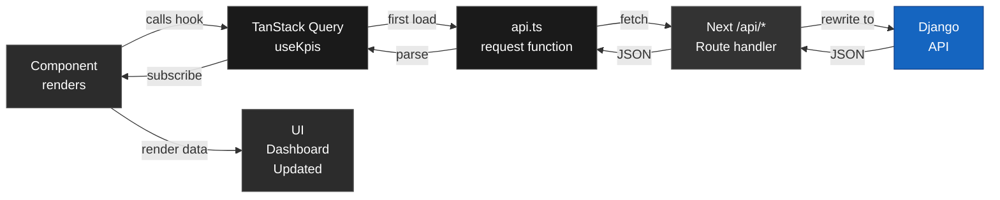

### State management

- **Server state** (mentions, KPIs, reports) → **TanStack Query**
  - Cached automatically
  - Invalidated when data changes
  - Refetched when you come back to a page

- **UI state** (sidebar, date range, theme) → **Zustand**
  - Saved to localStorage
  - Small stores with no side effects

- **Form state** (login, register, profile) → **React Hook Form**
  - Validation and error messages
  - Submit handling

---

## The backend

`backend/` is a small Django project with two apps: `accounts` for sign-in and `intel` for everything else.

**Data stored in the database** (SQLite, queryable):
- `Mention` – the hand-written posts in the mentions inbox, with notes and suggested replies
- `MentionEvent` – the brand's mention history (about 10,000 rows over 14 weeks) behind every chart
- `Alert` / `AlertRule` – notifications and the rules that trigger them
- `Report` / `ScheduledReport` – saved and scheduled reports
- `Crisis` – crisis incidents and their timeline
- `TeamUser` – team members
- `Integration` – connected social accounts
- `AuditLog` – who did what, and when

`python manage.py seed_data` fills these with the Vela demo dataset.

### Where the numbers come from

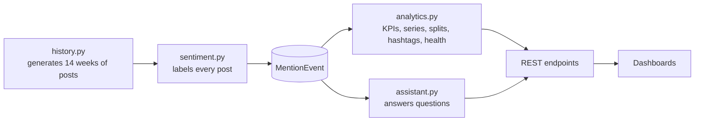

**`history.py`** builds the demo brand's story: steady growth from the #VelaGlow campaign, then a false product-recall rumour two days ago that sends negative posts up sharply. Posts are created from templates and labelled by `sentiment.analyze()`, exactly as a live feed would be labelled on arrival. A fixed random seed makes every run identical, which keeps tests and screenshots stable.

**`analytics.py`** computes everything the overview and analytics screens show, using rolling windows that end now ("this week" is the last 7 days, compared with the 7 days before):

| Endpoint | Calculation |
|---|---|
| `/api/kpis` | Mentions, reach, engagement rate (engagement ÷ reach), positive share and response rate for this week, the change on last week, and a 10-day sparkline |
| `/api/brand-health` | 0.55 × positive % + 0.30 × response % + 0.15 × (100 − 3 × negative %), clamped to 0–100. 75+ is healthy, 50–74 at risk, below 50 critical. Drivers explain the change on last week |
| `/api/mention-volume`, `/api/engagement-series` | One bucket per 24 hours for 7, 30 or 90 days |
| `/api/sentiment-distribution`, `/api/platform-breakdown`, `/api/platform-comparison` | Shares over the last 30 days |
| `/api/hashtags`, `/api/trends` | Hashtag volume, reach, week-on-week change and a 7-day sparkline. Anything containing "recall" is flagged critical |
| `/api/sentiment-bars` | Positive, neutral and negative share for each of the last 14 weeks |
| `/api/live-feed` | The five newest posts |

Run the overview during the rumour and the brand health drops into "AT RISK", #VelaRecall appears in the trends as new, the negative line jumps on the volume chart, and the assistant reports the share of posts with risk language. None of that is typed in: it falls out of the data.

**Still fixed in code** (`mock_data.py`): the four report templates and the sample post shown when a link (rather than text) is analysed, because fetching a live post needs platform API access.

---

## The sentiment and risk engine

`backend/intel/sentiment.py` scores short social posts without any model download or API key. It is a lexicon-based analyser tuned for the way people write online:

| Step | What it does | Example |
|---|---|---|
| Tokenise | Words, hashtags and @handles | `#VelaGlow`, `@tech_maren` |
| Lexicon lookup | Each word has a weight from -3 to +3 | `love` +3, `awful` -3, `recall` -2 |
| Negation | A negator in the three words before flips and softens the weight | "not good" is negative |
| Intensifiers | "really", "so", "absolutely" multiply the weight | "really good" > "good" |
| Shouting and emoji | ALL CAPS words count 1.3x; emoji carry their own weight | "GOOD 😍😍" |
| Exclamation marks | Amplify whichever tone is dominant | "love it!!!" |
| Neutral share | Shrinks as the text carries more sentiment words | a long factual post stays neutral |

The output is a positive / neutral / negative split that always adds up to 100, a label (positive, negative, mixed or neutral), a confidence score, the top emotions (joy, trust, fear, anger, distrust ...), topics (hashtags plus repeated keywords) and **risk terms** such as recall, contamination, lawsuit or unsafe.

On the hand-labelled demo mentions it agrees with the human label on 7 out of 8 posts, and a test fails if that drops below 75%.

`POST /api/post-analysis` with `{"text": "..."}` runs the engine and turns the result into scores, positive and risk indicators and recommendations:

```json
{
  "label": "negative",
  "sentiment": {"positive": 0, "neutral": 33, "negative": 67, "tone": "Fear"},
  "risks": ["mentions recall", "mentions sick", "\"got sick\""],
  "recommendations": [{"title": "Respond before it spreads", "desc": "The post mentions recall, sick. Reply with facts or a source, and flag it to the crisis team."}]
}
```

## The data assistant

`backend/intel/assistant.py` routes each question by keyword to a handler that queries the database:

| Question about | Answer is built from |
|---|---|
| Risks, crisis, threats | Mentions run through the risk scan, plus any open crisis |
| Influencers, creators | The `Influencer` table, by impact score, with negative voices flagged |
| Platforms, channels | Mention counts and negative counts per platform |
| Improving engagement | Unassigned mentions and positive posts worth amplifying |
| Sentiment, audience, campaign | Sentiment split and the topics driving each side |
| Anything else | A short summary and a list of what it can answer |

Because every number comes from the same tables as the dashboards, the assistant cannot contradict them. Swapping the router for an LLM call would only need a change in `assistant.reply()`.

**Every endpoint** requires a signed-in user except register, login, refresh and logout.

---

## Tech stack

**Frontend:**
- Next.js 16 (App Router)
- React 19
- TypeScript
- Tailwind CSS v4
- Recharts (charts)
- TanStack Query (server state)
- Zustand (UI state)
- React Hook Form (forms)
- lucide-react (icons)

**Backend:**
- Django 5.1
- Django REST Framework
- djangorestframework-simplejwt (JWT, with refresh token blacklisting)
- ReportLab (PDF reports)
- Gunicorn (in the Docker image)
- SQLite (swap for Postgres in production)

**Tooling:**
- GitHub Actions: Django tests, TypeScript check, `next build`, and a Docker Compose run that signs in and calls the API through the Next.js proxy
- Docker and Docker Compose

---

## Tests

```bash
cd backend
.venv\Scripts\python manage.py test      # Windows
# .venv/bin/python manage.py test        # macOS/Linux
```

The backend tests check that:

- registering creates both the login account and the team profile, and refuses a duplicate email
- login works with email and password and rejects a wrong password
- the API only accepts the token from the `access_token` cookie, not from an `Authorization` header
- logging out blacklists the refresh token so it cannot be used again
- every data endpoint returns 401 to anonymous callers and 200 to the seeded demo user
- the sentiment engine handles positive, negative, mixed and neutral text, negation, emoji and shouting, finds risk terms, and its percentages always add up to 100
- the engine agrees with at least 75% of the hand-labelled demo mentions
- pasted text gets the right label, risk list and recommendations; very long text is rejected
- the assistant answers sentiment, risk, influencer and platform questions from real counts, and falls back to a summary
- every aggregate works on an empty database; the KPI and volume numbers match direct database counts; percentage splits add up to 100; the history generator is deterministic and its labels come from the engine; the rumour shows up in the latest week, the trends and the health score

Frontend tests run with [Vitest](https://vitest.dev):

```bash
npm test
```

They cover the API layer in `src/lib/api.ts` (a 401 triggers one token refresh and a retry, requests failing at the same time share a single refresh, a failed refresh gives up, error messages come from the API) and the formatting and CSV helpers.

`npm run typecheck` runs the TypeScript compiler and `npm run build` makes a production build.

---

## Environment variables

Nothing needs to be set for local development. For a deployment:

| Variable | Used by | Default | Purpose |
|---|---|---|---|
| `DJANGO_API_URL` | Next.js | `http://127.0.0.1:8500/api` | Where the `/api/*` rewrite sends requests |
| `DJANGO_SECRET_KEY` | Django | a dev-only key | Signs the JWTs. Set a long random value in production |
| `DJANGO_DEBUG` | Django | `1` | Set to `0` in production |
| `DJANGO_ALLOWED_HOSTS` | Django | `localhost,127.0.0.1,testserver` | Comma-separated host names Django will answer to |
| `DJANGO_CORS_ORIGINS` | Django | `http://localhost:3000,http://127.0.0.1:3000` | Only matters if something calls Django directly |

---

## Deployment

The project currently runs locally. To deploy it:

- **Frontend:** deploy the `next build` output to Vercel, Netlify or any Node host
- **Backend:** deploy Django to a host such as Railway, Render or AWS, and switch SQLite for Postgres
- Set the environment variables above, with `DJANGO_API_URL` pointing at the deployed Django server

---

## Common tasks

### Add a new screen

1. Create a folder in `src/app/(app)/your-route/`
2. Add `page.tsx` (and `layout.tsx` if it needs one)
3. Reuse components from `src/components/` or add new ones
4. Fetch data with hooks from `src/lib/queries.ts`
5. Add it to the sidebar in `src/components/layout/nav.ts`

### Add a new API endpoint

1. Add a model in `backend/intel/models.py` and run `makemigrations`
2. Add a serializer in `backend/intel/serializers.py`
3. Add a view in `backend/intel/views.py`
4. Register it in `backend/intel/urls.py`
5. Add a test in `backend/intel/tests.py`
6. Add a query hook in `src/lib/queries.ts` and call it from a component

### Change the design system

1. Edit the CSS tokens in `src/app/globals.css` (`@theme`)
2. Adjust the sentiment colours, spacing and fonts
3. Restart `npm run dev`

---

## Troubleshooting

**"npm ERR! peer dependency"**
```bash
npm install --legacy-peer-deps
```

**Backend won't start**
- Check port 8500 is free
- Run `python manage.py migrate` first
- Run `python manage.py seed_data` to load the demo data

**Frontend can't reach the backend**
- Is Django running on port 8500?
- Check `DJANGO_API_URL` (defaults to `http://127.0.0.1:8500/api`)
- Look for errors in the browser console and the Django terminal

**Can't sign in**
- Use the seeded credentials: `ochiengs@vela.co` / `vela-demo-2026`
- Check the httpOnly cookie is being set (DevTools → Application → Cookies)
- Check the Django terminal for auth errors

---

## Contributing

1. Fork the repo
2. Create a feature branch (`git checkout -b feature/your-feature`)
3. Commit your changes
4. Push (`git push origin feature/your-feature`)
5. Open a pull request

Please run the backend tests and `npm run typecheck` before opening a pull request.

---

## Notes

- Mentions are demo data. A production version would pull them from the platform APIs (X API v2, Meta Graph API, LinkedIn API) and run each one through `sentiment.py` on arrival.
- The seeded dataset follows "Vela", a fictional drinks brand dealing with a false product-recall rumour.

## License

MIT. See [LICENSE](LICENSE).

## Author

**Mark Kinuthia** - [github.com/kinuthia-mark](https://github.com/kinuthia-mark)
