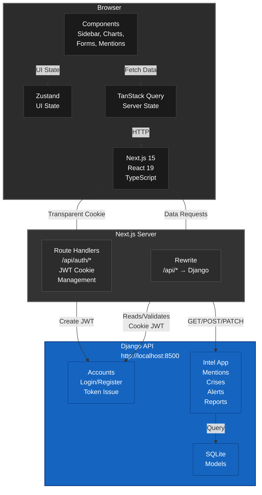
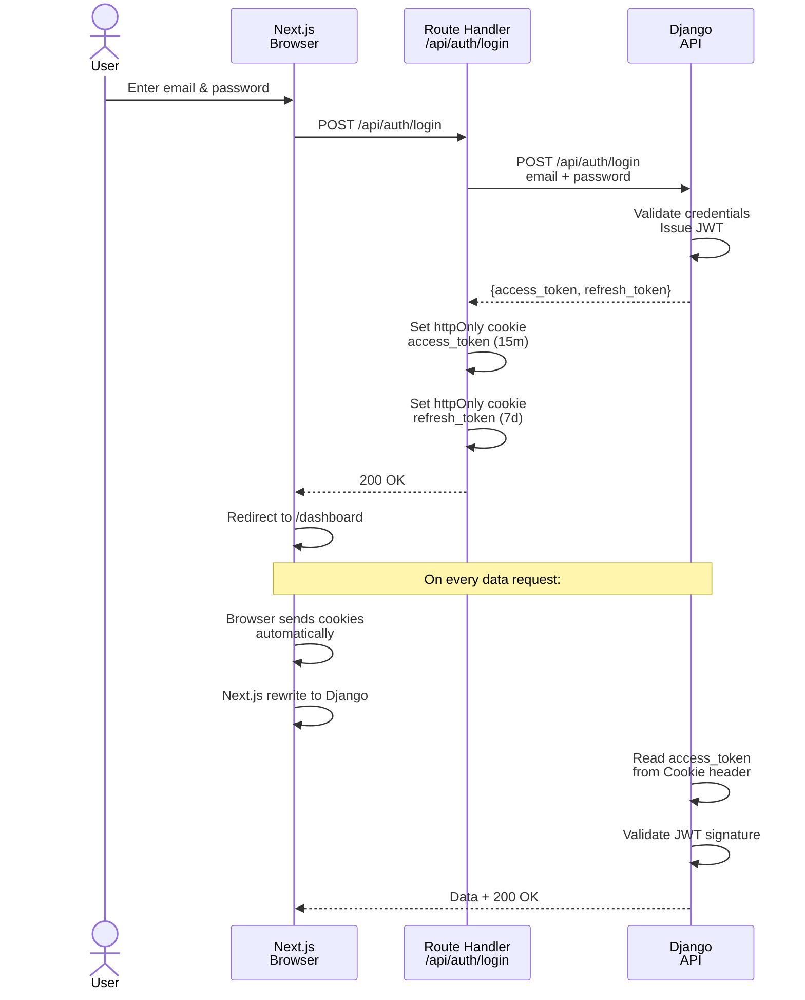
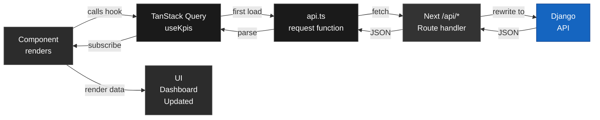

# socialNET Intelligence

Brand monitoring and social media intelligence platform. Monitor mentions, track sentiment, manage crises, and report to leadership — all from one dashboard.

Think Brandwatch or Sprout Social, but built for speed.

---

## What it is

You have a brand. People talk about it on social media. Most of that noise is irrelevant. Some of it is a PR crisis.

socialNET watches Twitter, Instagram, LinkedIn, etc. for mentions of your brand. It filters the noise, flags the crisis, shows you what your audience actually thinks, and hands you a report to send to your CEO.

16 screens. Everything you need to manage brand reputation. Nothing you don't.

---

## Quick start

You need two terminals running at the same time.

### Backend (Django)

```bash
cd backend
python -m venv .venv
.venv\Scripts\pip install -r requirements.txt     # Windows
# .venv/bin/pip install -r requirements.txt       # macOS/Linux

.venv\Scripts\python manage.py migrate
.venv\Scripts\python manage.py seed_data
.venv\Scripts\python manage.py runserver 8500
```

That's running on `http://localhost:8500`.

### Frontend (Next.js)

In a **new terminal**:

```bash
npm install
npm run dev
```

Go to `http://localhost:3000`.

### Sign in

Use the seeded demo account:
- **Email:** ochiengs@vela.co
- **Password:** vela-demo-2026

(Everyone in the demo dataset shares that password. Or register a new account.)

---

## Architecture



**The flow:**
1. You use the app (browser)
2. Components request data via TanStack Query
3. Queries call `src/lib/api.ts`
4. API layer hits Next.js `/api/*` endpoints
5. Next.js rewrites to Django (`/api/auth/*` for cookies, everything else for data)
6. Django validates your JWT cookie and returns JSON
7. Components re-render with new data

Your browser **never** talks to Django directly. All requests go through Next.js first.

---

## Authentication flow



**Key points:**
- Tokens live in **httpOnly cookies** — your browser can't read them (safer)
- Access token lasts 15 minutes
- Refresh token lasts 7 days
- When access expires, `src/lib/api.ts` auto-refreshes and retries (you don't see it)
- CSRF protection via `SameSite=Lax` on cookies

---

## The 16 screens

| Route | What it does |
|-------|------------|
| `/` | Landing page |
| `/login` | Sign in |
| `/register` | Create account |
| `/dashboard` | KPIs, trends, executive summary |
| `/mentions` | Browse all mentions, filter by sentiment/platform/date |
| `/mentions/:id` | Detail view of a single mention (slide-over panel) |
| `/analytics` | Deep dive: sentiment breakdown, audience demographics, influencers, heatmaps |
| `/engagement` | Track replies, shares, engagement rate |
| `/alerts` | Notification center, set alert rules |
| `/reports` | Generate & schedule reports for leadership |
| `/post-analysis` | AI analysis of your own posts |
| `/assistant` | Chat with the AI assistant |
| `/crisis` | Crisis management command center |
| `/admin/users` | Manage team members |
| `/admin/integrations` | Connect Twitter, Instagram, LinkedIn accounts |
| `/admin/audit` | View audit logs |
| `/settings` | Profile & preferences |

Every screen has:
- Loading skeletons (while data fetches)
- Empty states (no data to show)
- Responsive design (desktop → tablet → mobile)

---

## Directory structure

```
.
├── src/
│   ├── app/
│   │   ├── (auth)/
│   │   │   ├── login/
│   │   │   └── register/
│   │   ├── (app)/
│   │   │   ├── dashboard/
│   │   │   ├── mentions/
│   │   │   ├── analytics/
│   │   │   ├── crisis/
│   │   │   ├── admin/
│   │   │   └── settings/
│   │   ├── api/
│   │   │   └── auth/         ← JWT cookie handlers (login, register, refresh, logout)
│   │   ├── layout.tsx        ← Root layout + providers
│   │   └── page.tsx          ← Landing page
│   ├── components/
│   │   ├── layout/           ← Sidebar, Topbar, PageHeading
│   │   ├── ui/               ← Button, Card, Badge, Avatar, Modal, Sheet, etc.
│   │   ├── charts/           ← Recharts wrappers
│   │   ├── dashboard/        ← Dashboard-specific components
│   │   └── mentions/         ← Mention card, detail view
│   ├── lib/
│   │   ├── api.ts            ← ⭐ THE SEAM: all backend calls go here
│   │   ├── queries.ts        ← TanStack Query hooks (useKpis, useMentions, etc.)
│   │   ├── store.ts          ← Zustand stores (dateRange, sidebarOpen, etc.)
│   │   ├── types.ts          ← TypeScript interfaces (mirrors Django models)
│   │   ├── authCookies.ts    ← Cookie constants shared with route handlers
│   │   └── utils.ts          ← Formatting helpers
│   ├── middleware.ts         ← Redirects unauthenticated users to /login
│   └── app.globals.css       ← Design tokens (colors, spacing, fonts)
├── backend/
│   ├── config/               ← Django project settings
│   ├── accounts/             ← Login, register, JWT logic
│   ├── intel/                ← Main app (models, views, serializers)
│   │   ├── models.py         ← Mention, Alert, Report, Crisis, etc.
│   │   ├── views.py          ← API endpoints
│   │   ├── serializers.py    ← JSON serialization
│   │   ├── mock_data.py      ← Canned responses (KPIs, charts, AI replies)
│   │   └── management/commands/seed_data.py  ← Load demo dataset
│   └── manage.py
├── next.config.mjs           ← Rewrite /api/* to Django
├── package.json
├── tsconfig.json
├── tailwind.config.ts        ← Design system
└── README.md
```

---

## Data flow inside the app

### Component → UI Update (in 3 steps)



### State management

- **Server state** (mentions, KPIs, reports) → **TanStack Query**
  - Cached automatically
  - Invalidated when data changes
  - Refetches when you revisit the page

- **UI state** (which sidebar is open, date range, theme) → **Zustand**
  - Persists to localStorage
  - Minimal, no side effects

- **Form state** (login, register, settings) → **React Hook Form**
  - Validation
  - Error messages
  - Submit handling

---

## The backend

`backend/` is small and focused. It's not a monolith.

**Model-backed data** (SQLite, queryable):
- `Mention` — One social media post mentioning your brand
- `Alert` / `AlertRule` — Notifications and rules that trigger them
- `Report` / `ScheduledReport` — Reports, saved and scheduled
- `Crisis` — Crisis incidents
- `TeamUser` — Team members
- `Integration` — Connected social accounts
- `AuditLog` — Who did what when

Loaded by `python manage.py seed_data` with the Vela demo dataset.

**Code-backed data** (in `mock_data.py`, not queryable):
- KPI cards (follower growth, sentiment trend)
- Brand health score
- Mention volume chart
- Sentiment breakdown
- Platform breakdown
- Trending hashtags
- AI assistant responses
- Sample post analysis

These are hardcoded demo values that the API returns. In production, these would hit a real analytics service or database.

**Every endpoint** requires authentication (`IsAuthenticated`) except `/api/auth/register`, `/api/auth/login`, and the refresh endpoint.

---

## Tech stack

**Frontend:**
- Next.js 15 (App Router)
- React 19
- TypeScript
- Tailwind CSS v4 (design system)
- Recharts (charts)
- TanStack Query (server state)
- Zustand (UI state)
- React Hook Form (forms)

**Backend:**
- Django 5.0
- Django REST Framework (DRF)
- djangorestframework-simplejwt (JWT)
- SQLite (demo; swap for Postgres)

**Both:**
- Git / GitHub

---

## Deployment

Right now, this is **local development only**. 

To deploy:
- **Frontend:** Deploy the `next build` output to Vercel, Netlify, or any Node host
- **Backend:** Deploy Django to AWS, Heroku, Railway, or similar
- Update `DJANGO_API_URL` in the Next.js build to point to your production Django server

See `next.config.mjs` and `backend/config/settings.py` for environment variables.

---

## Common tasks

### Add a new screen

1. Create a folder in `src/app/(app)/your-route/`
2. Add `page.tsx` (the page) and `layout.tsx` (optional)
3. Use existing components from `src/components/` or build new ones
4. Call hooks from `src/lib/queries.ts` to fetch data
5. Wire up the sidebar nav in `src/components/layout/nav-config.ts`

### Add a new API endpoint

1. Add a model in `backend/intel/models.py`
2. Add a serializer in `backend/intel/serializers.py`
3. Add a view in `backend/intel/views.py`
4. Wire it up in `backend/intel/urls.py`
5. Add a query hook in `src/lib/queries.ts`
6. Call it from a component

### Change the design system

1. Edit CSS tokens in `src/app/globals.css` (`@theme`)
2. Update sentiment colors, spacing, etc.
3. Rebuild

---

## Troubleshooting

**"npm ERR! peer dependency"**
```bash
npm install --legacy-peer-deps
```

**Backend won't start**
- Check port 8500 is free
- Run `python manage.py migrate` first
- Run `python manage.py seed_data` to load demo data

**Frontend won't connect to backend**
- Is Django running on 8500?
- Check `DJANGO_API_URL` (defaults to `http://127.0.0.1:8500/api`)
- Check browser console for CORS errors (shouldn't happen since we rewrite)

**Can't sign in**
- Use the seeded credentials: `ochiengs@vela.co` / `vela-demo-2026`
- Check the httpOnly cookie is being set (`DevTools → Application → Cookies`)
- Check Django logs for auth errors

---

## Contributing

1. Fork the repo
2. Create a feature branch (`git checkout -b feature/your-feature`)
3. Commit changes (`git commit -am 'Add feature'`)
4. Push (`git push origin feature/your-feature`)
5. Open a Pull Request

Code style:
- Use TypeScript strict mode
- Format with Prettier
- Keep components small and focused

---

## License

MIT. Use it, fork it, build on it.

---

## Notes

- The original design file (`socialNET.dc.html`) is gated behind Claude. If you have it, share it locally to pixel-check the implementation.
- This is a demo with canned data. In production, integrate real social media APIs (Twitter API v2, Meta Graph API, LinkedIn API).
- The seeded dataset is Vela's recall-rumor storyline — a fictional brand crisis for demo purposes.

